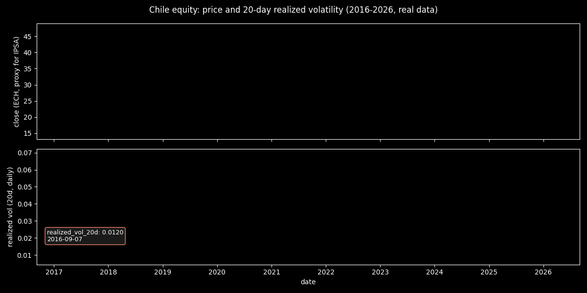
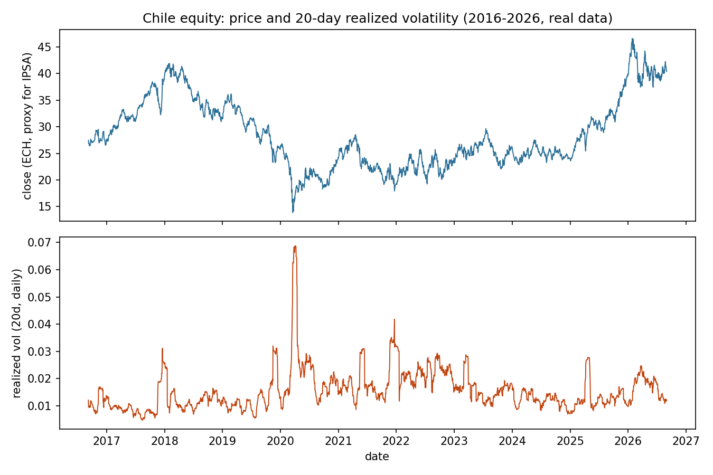
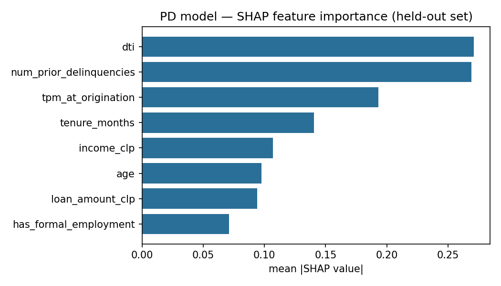
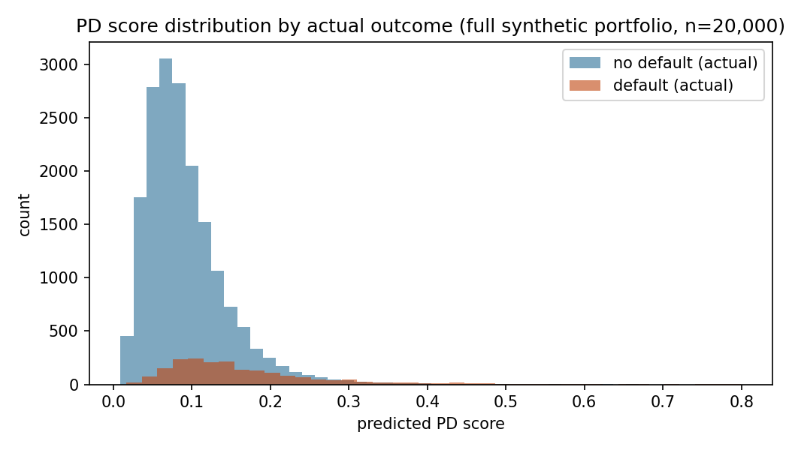
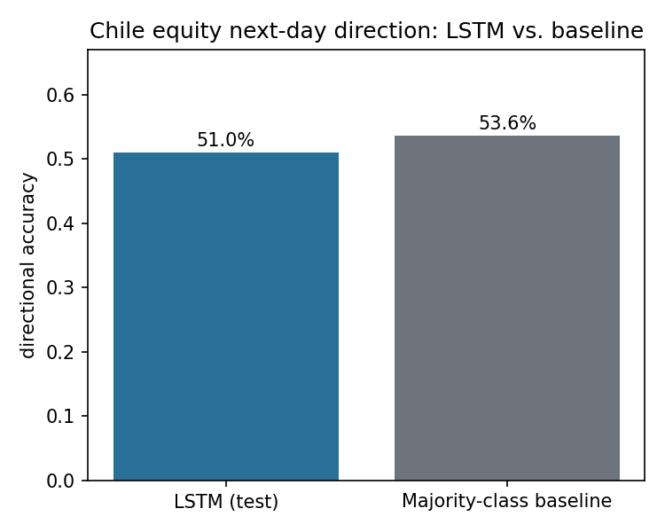
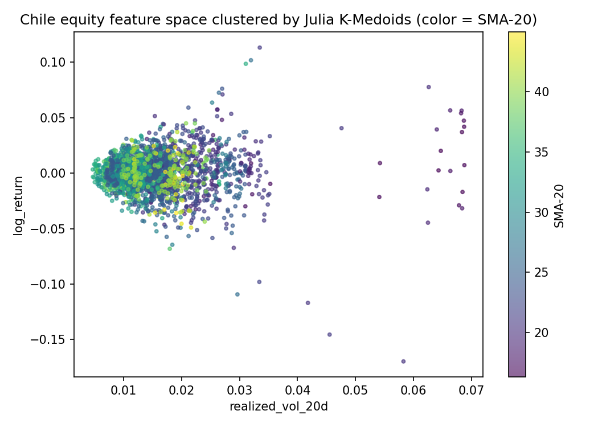

[ 🇨🇱 Versión en Español ](#-español) &nbsp;|&nbsp; [ 🇺🇸 English Version ](#-english)

---

<a name="-español"></a>
# chile-fintech-systemic-risk

Arquitectura políglota para análisis de riesgo sistémico del mercado financiero chileno (IPSA, tasas del Banco Central, riesgo crediticio). Cada lenguaje se eligió por la tarea que resuelve mejor, no por completitud del portafolio — ver justificación por módulo abajo.

**Estado del proyecto: los 5 módulos son funcionales y corren con datos reales.** Este README documenta resultados reales, incluyendo hallazgos honestos-negativos, en vez de maquillarlos. Todas las cifras de este documento salen de una re-ejecución completa de los 5 módulos el 2026-09-02; donde el número cambió levemente frente a una corrida anterior (aleatoriedad de inicialización de pesos, timing de CPU) se dejó el valor de esta corrida.

## El problema

El riesgo sistémico de un mercado financiero pequeño y concentrado como el chileno no vive en una sola fuente de datos: vive en cómo un shock en una capa se propaga a las demás. Una subida de tasa del Banco Central (TPM) presiona el costo de financiamiento de los hogares endeudados, lo que sube la probabilidad de default (PD) de la cartera de crédito; al mismo tiempo, la volatilidad del mercado accionario (IPSA) tiende a subir junto con la incertidumbre de tasas, y esa volatilidad es justamente el insumo que un motor de pricing/VaR necesita para cuantificar cuánto puede perder una posición en un día malo. Ningún modelo aislado —ni el de crédito, ni el de mercado— captura esa cadena completa.

Este repo construye esa cadena de punta a punta con datos reales donde existen y con supuestos documentados donde no: **ETL** consolida series públicas del Banco Central de Chile y el precio diario de un proxy del IPSA en un store analítico; **ml_predictions** estima PD de crédito (XGBoost, con SHAP obligatorio porque un modelo de crédito no explicable no es desplegable bajo un estándar regulatorio razonable) y dirección de mercado (LSTM); **quant_analytics** aporta el aparataje econométrico clásico (cointegración, GARCH) que un equipo de riesgo esperaría ver antes de confiar en un modelo de ML, más clustering de regímenes de volatilidad y de perfiles de riesgo; **core_engine** traduce la volatilidad real observada en una métrica de VaR/ES accionable; y **api** expone todo eso como sería consumido en producción — scoring servido con baja latencia, y un punto de integración explícito hacia un core bancario legado. El hilo conductor no es "un modelo por módulo", es una sola cadena de riesgo que atraviesa cinco lenguajes porque cada eslabón de esa cadena tiene requisitos distintos (explicabilidad regulatoria, rigor econométrico, throughput de requests, latencia de cómputo numérico).

Un resultado honesto de este ejercicio: el mercado chileno, medido con los datos públicos disponibles, se comporta de forma difícil de predecir direccionalmente (el LSTM no le gana a un baseline trivial) pero con volatilidad muy persistente (GARCH ≈ 0.987) — dos caras de la misma moneda, y ambas relevantes para cómo se debería gestionar el riesgo en la práctica: no confiar en predicción direccional, sí en gestión activa de exposición a volatilidad.

## Estructura

| Módulo | Lenguaje(s) | Estado |
|---|---|---|
| [`/etl`](etl) | Python + DuckDB (SQL) | ✅ Funcional, datos reales |
| [`/ml_predictions`](ml_predictions) | Python (XGBoost, PyTorch, SHAP) | ✅ Funcional (PD: sintético documentado; equity: datos reales) |
| [`/quant_analytics`](quant_analytics) | R + Julia | ✅ Funcional, datos reales |
| [`/core_engine`](core_engine) | C++ (OpenMP) | ✅ Funcional, datos reales |
| [`/api`](api) | Go + C# | ✅ Funcional, datos reales |

## Técnicas por módulo

| Módulo | Técnica / algoritmo | Librería(s) | Por qué |
|---|---|---|---|
| `/etl` | Vista SQL sobre store columnar (retorno log, SMA-20, volatilidad realizada 20d) | Polars, DuckDB | Feature engineering reproducible y auditable en SQL puro, sin recalcular en cada consumidor |
| `/ml_predictions` (PD) | Gradient boosting (XGBoost) + explicabilidad por valores de Shapley | `xgboost`, `shap`, scikit-learn | Árboles para tabular con variables mixtas; SHAP es obligatorio para un modelo de crédito, no opcional |
| `/ml_predictions` (equity) | LSTM de una capa sobre secuencias de 20 días (retorno log, SMA-20, vol. realizada) | PyTorch | Dependencia temporal explícita, comparada contra un baseline de clase mayoritaria |
| `/quant_analytics` (R) | Cointegración Engle-Granger (ADF sobre residuos), causalidad de Granger, ARIMA(1,0,0)-GARCH(1,1) | `urca`, `vars`, `tseries`, `rugarch` | El aparataje econométrico estándar que un equipo de riesgo de mercado exige antes de confiar en un modelo de ML |
| `/quant_analytics` (Julia) | K-Medoids (distancia euclidiana) sobre features estandarizadas | `Clustering.jl`, `Distances.jl` | Cómputo matricial puro sin el overhead del GIL de Python, apto para clustering repetido sobre ventanas grandes |
| `/core_engine` | Simulación Monte Carlo de Movimiento Browniano Geométrico, paralelizada | C++20 + OpenMP | Pricing de opción europea y VaR/ES 99% necesitan millones de trayectorias; el *hot path* requiere paralelismo real, no algo que Python dé sin FFI |
| `/api` (Go) | Servicio HTTP stdlib, *batch-scored offline / served online* | `net/http` (sin dependencias) | Throughput de requests concurrentes sirviendo predicciones ya calculadas, no cómputo numérico |
| `/api` (C#) | Stub de integración con core bancario legado, decisión basada en PD real | .NET 8 | Contrato de integración documentado (no mock oculto) hacia un sistema legado típico de banca chilena |

## `/etl` — lo que ya corre

Dos ingestores en Python (Polars) contra APIs públicas reales:

- **`fetch_bcch_indicators.py`**: TPM, UF, dólar, IPC, IMACEC desde [mindicador.cl](https://mindicador.cl) (fuente pública del Banco Central de Chile).
- **`fetch_chile_equity.py`**: serie diaria OHLCV de `ECH` (iShares MSCI Chile ETF) vía Yahoo Finance. **Nota honesta:** se usa `ECH` en vez del índice nativo `^IPSA` porque la API de `yfinance` para `^IPSA` tiene un gap real de datos y deja de devolver filas después de 2019-06-14 sin importar el rango solicitado (verificado 2026-08-31) — un fallo de la fuente, documentado en vez de escondido.
- **`build_duckdb.py`**: consolida ambas fuentes en `data/chile_fintech.duckdb`, con una vista `chile_equity_features` (retorno log, SMA-20, volatilidad realizada 20d) calculada en SQL puro sobre DuckDB.

```bash
python -m venv .venv && .venv/Scripts/pip install -r requirements.txt   # Windows
python etl/fetch_bcch_indicators.py
python etl/fetch_chile_equity.py
python etl/build_duckdb.py
```

Resultado verificado en esta sesión (2026-09-02): 155 filas de indicadores BCCh, 2,511 filas de `chile_equity_daily` (2016-09-02 → 2026-09-01).




La versión animada traza ambas series al ritmo real de los datos (submuestreados a ~45 frames de los 2,511 días) con una etiqueta flotante que marca el valor vigente en cada punto — útil para ver de un vistazo dónde se dispara la volatilidad, aunque el gráfico estático de abajo sigue siendo la referencia para lectura detallada.

Serie completa de `ECH` 2016-2026: el panel superior es el precio de cierre, el inferior la volatilidad realizada de 20 días calculada en la vista SQL de DuckDB — se ve cómo los picos de volatilidad coinciden con los tramos de precio más agitados, la base para todo lo que viene después (LSTM, GARCH, clustering).

## `/ml_predictions` — lo que ya corre

```bash
python ml_predictions/simulate_credit_portfolio.py   # cartera sintética documentada
python ml_predictions/train_pd_model.py               # XGBoost + SHAP
python ml_predictions/train_lstm_equity.py             # LSTM direccional sobre datos reales
python ml_predictions/make_charts.py
```

- **PD (XGBoost + SHAP):** AUC held-out = **0.6239** sobre cartera de crédito sintética documentada de 20,000 solicitudes, tasa de default = 10.01% (no hay fuente pública chilena a nivel de deudor individual). SHAP confirma que `dti` (0.271) y morosidad previa (0.269) dominan el |SHAP value| promedio, como está diseñado en la simulación.




`dti` y `num_prior_delinquencies` concentran la mayor parte del |SHAP value| promedio — exactamente las dos variables con más peso en la función logística que generó los defaults sintéticos, así que este gráfico funciona como verificación de que el pipeline de explicabilidad recupera la señal real, no ruido. La distribución de PD scores muestra la separación (parcial, consistente con un AUC de 0.62) entre solicitudes que efectivamente cayeron en default y las que no.

- **LSTM direccional (datos reales):** accuracy de test = **51.0%**, por debajo del baseline de clase mayoritaria (**53.6%**). Hallazgo honesto, no descartado: con retornos diarios de un activo altamente líquido y volatilidad muy persistente (ver GARCH abajo), la dirección día-a-día se comporta cerca de un camino aleatorio — el modelo no encuentra señal explotable en las tres features usadas (retorno log, SMA-20, vol. realizada 20d).



La barra del LSTM queda por debajo de la del baseline — no es un gráfico decorativo, es la evidencia visual del hallazgo honesto-negativo: predecir siempre la clase más frecuente le gana al modelo entrenado.

## `/quant_analytics` — lo que ya corre

```bash
Rscript quant_analytics/r/macro_econometrics.R
python quant_analytics/julia/export_for_julia.py && julia quant_analytics/julia/cluster_profiles.jl
python quant_analytics/make_charts.py
```

- **R:** cointegración UF vs. dólar (Engle-Granger, ADF sobre residuos) da estadístico = **-1.851** con apenas n=22 observaciones mensuales — insuficiente para concluir, documentado honestamente en vez de forzar una lectura. Causalidad de Granger de TPM sobre retornos no es evaluable en esta ventana (solo 1 valor único de TPM en los ~30 días alineados). GARCH(1,1) sobre 2,510 retornos diarios sí es concluyente: persistencia de volatilidad (α+β) = **0.9871** — volatilidad extremadamente persistente, coherente con el LSTM que no supera su baseline.
- **Julia:** K-Medoids (k=3) separa regímenes de volatilidad reales del activo chileno — el cluster de mayor volatilidad (n=10, vol. promedio 20d = 5.05%) tiene retorno promedio **negativo** (-8.29%), los otros dos clusters (vol. 1.18% y 1.83%) tienen retorno positivo. K-Medoids (k=4) sobre perfiles de crédito: el cluster de menor DTI (0.209) tiene default rate = **6.1%**, el de mayor DTI entre los evaluados (0.348) llega a **13.6%**.



## `/core_engine` — lo que ya corre

```bash
python core_engine/cpp/export_params.py
cl /O2 /openmp /EHsc core_engine/cpp/montecarlo_var.cpp /Fe:core_engine/cpp/montecarlo_var.exe
core_engine/cpp/montecarlo_var.exe core_engine/cpp/data/market_params.csv core_engine/cpp/data/pnl_sample.csv
```

Motor Monte Carlo (GBM) en C++20 + OpenMP, alimentado con spot (40.39 CLP) y volatilidad anualizada real (18.97%) del activo chileno: pricing de opción call europea (strike 41.20, precio = 0.601 ± 0.0011 stderr) y VaR/ES 99% a 1 día de una posición larga. Resultado real de esta corrida: **1,000,000 trayectorias en 14.6 ms** con 16 hilos OpenMP; VaR 99% = 27,485, ES 99% = 31,406 (unidades del notional configurado).


Histograma de una submuestra de 20,000 trayectorias de PnL a 1 día (la métrica de VaR/ES se calcula igual sobre el millón completo). Las líneas verticales marcan dónde caen el VaR 99% y el Expected Shortfall 99% sobre esa distribución — la cola izquierda es justamente lo que ambas métricas están midiendo.

## `/api` — lo que ya corre

```bash
python api/go/export_predictions.py && go run api/go/main.go
cd api/corporate_stubs/legacy_core_stub && dotnet run
```

Servicio Go (stdlib, sin dependencias) que sirve predicciones ya calculadas por los modelos Python/XGBoost — verificado en esta sesión desde la raíz del repo: `/health` → `ok`; `/v1/equity/snapshot` responde cierre=40.39, retorno log=-0.00272, vol. realizada 20d=0.0120, junto con las métricas del LSTM; `/v1/credit/predictions` sirve las 200 solicitudes con `pd_score` real (ej. applicant_id 0: PD=0.0724, DTI=0.23; applicant_id 1: PD=0.1338, DTI=0.275). Stub C#/.NET de integración con core bancario legado compiló y corrió: dos decisiones de crédito (una aprobada, una rechazada) basadas en los PD scores reales del modelo.

## Dashboard interactivo (Plotly, offline)

**[Abrir el dashboard interactivo en el navegador](https://htmlpreview.github.io/?https://github.com/Rxyxs/chile-fintech-systemic-risk/blob/main/outputs/interactive/systemic_risk_dashboard.html)**

HTML autocontenido (`outputs/interactive/systemic_risk_dashboard.html`, generado por `scripts/make_interactive_dashboard.py` con `plotly`) construido directamente desde `chile_fintech.duckdb` y desde las 200 predicciones reales servidas por el API Go — sin datos inventados. El enlace de arriba usa `htmlpreview.github.io` para renderizarlo en vivo en el navegador sin clonar el repo. Incluye:

1. Precio de cierre de `ECH` + SMA-20 (eje izquierdo) y volatilidad realizada 20d (eje derecho), con range-slider interactivo sobre los 2,509 días con feature calculada.
2. Scatter de PD score (XGBoost) vs. DTI para las 200 solicitudes servidas por el API, coloreado por si la solicitud efectivamente cayó en default — se ve la correlación positiva esperada entre DTI/PD score y default real, con ruido suficiente para explicar por qué el AUC es 0.62 y no más alto.

## Por qué esta separación de lenguajes

- **Python + SQL (DuckDB)** para ETL: ecosistema de datos maduro, DuckDB da almacenamiento columnar local sin la operación de un warehouse real, adecuado para series de tiempo financieras de este tamaño.
- **XGBoost/LightGBM + PyTorch** para modelado: árboles de gradiente para PD tabular con SHAP obligatorio (explicabilidad regulatoria), deep learning para series de tiempo donde la dependencia temporal importa más que features tabulares.
- **R** para econometría clásica (cointegración, Granger, ARIMA/GARCH): sigue siendo el ecosistema con mejor soporte y validación académica para estos tests específicos.
- **Julia** para clustering de alta velocidad: cálculo matricial sin el overhead del GIL de Python, relevante para clustering sobre ventanas rolling grandes.
- **C++** para el motor Monte Carlo de pricing/VaR: el *hot-path* del sistema necesita control de memoria y paralelismo real (OpenMP), no algo que Python pueda dar sin FFI de todas formas.
- **Go** para el API de predicciones: throughput de muchas requests concurrentes de scoring, no cómputo pesado — el modelo ya corrió offline.

## Resultados clave (re-ejecución 2026-09-02)

| Módulo | Métrica | Resultado |
|---|---|---|
| PD (XGBoost+SHAP) | AUC held-out | 0.6239 |
| Dirección equity (LSTM) | Accuracy vs. baseline | 51.0% vs. **53.6%** (no supera baseline) |
| Econometría (R, GARCH) | Persistencia de volatilidad | 0.9871 |
| Econometría (R, cointegración) | ADF sobre residuos (UF vs. USD) | -1.851 (n=22, no concluyente) |
| Clustering (Julia) | Default rate, cluster de menor DTI | 6.1% (vs. 13.6% del más riesgoso evaluado) |
| Motor Monte Carlo (C++) | 1M trayectorias | 14.6 ms, 16 hilos |
| API Go | Endpoints verificados en vivo | `/health`, `/v1/equity/snapshot`, `/v1/credit/predictions` — 200 predicciones reales |
| Stub C#/.NET | Decisiones de crédito verificadas | 1 aprobada, 1 rechazada, ambas basadas en PD real |

## Próximos pasos

Los 5 módulos ya son funcionales con datos reales. Mejoras pendientes documentadas en cada README de módulo: Temporal Fusion Transformer y ensamble LightGBM en `/ml_predictions`, ventana de datos más larga para los tests econométricos en `/quant_analytics`, y evaluación de Rust/Java como alternativas en `/core_engine` y `/api` respectivamente.

---

<a name="-english"></a>
# chile-fintech-systemic-risk (English)

Polyglot architecture for systemic risk analysis of the Chilean financial market (IPSA, Central Bank rates, credit risk). Each language was chosen for the task it solves best, not for portfolio completeness.

**Project status: all 5 modules are functional and run on real data.** This README honestly documents real results, including honest-negative findings, rather than inflating them. Every figure in this document comes from a full re-run of all 5 modules on 2026-09-02; where a number shifted slightly from an earlier run (weight-init randomness, CPU timing) this run's value is what's shown.

## The problem

Systemic risk in a small, concentrated market like Chile's doesn't live in any single data source — it lives in how a shock in one layer propagates to the others. A Central Bank (BCCh) rate hike raises the financing cost for indebted households, which raises the probability of default (PD) on the credit book; at the same time, equity-market volatility (IPSA) tends to rise alongside rate uncertainty, and that volatility is exactly the input a pricing/VaR engine needs to quantify how much a position can lose on a bad day. No single model — not the credit model, not the market model — captures that full chain on its own.

This repo builds that chain end to end, with real data where it exists and documented assumptions where it doesn't: **ETL** consolidates public Chilean Central Bank series and a daily IPSA-proxy price into an analytical store; **ml_predictions** estimates credit PD (XGBoost, with SHAP as a hard requirement — a credit model that isn't explainable isn't deployable under any reasonable regulatory standard) and market direction (LSTM); **quant_analytics** supplies the classical econometric apparatus (cointegration, GARCH) a market-risk team would expect before trusting any ML model, plus clustering of volatility regimes and risk profiles; **core_engine** turns the real observed volatility into an actionable VaR/ES metric; and **api** exposes all of that the way it would actually be consumed in production — low-latency scoring, plus an explicit integration point into a legacy banking core. The thread running through all five isn't "one model per module" — it's a single risk chain that happens to cross five languages because each link in that chain has genuinely different requirements (regulatory explainability, econometric rigor, request throughput, numerical-compute latency).

One honest result of this exercise: measured against the public data actually available, the Chilean market behaves in a way that's hard to predict directionally (the LSTM doesn't beat a trivial baseline) but with highly persistent volatility (GARCH ≈ 0.987) — two sides of the same coin, and both relevant to how risk should actually be managed in practice: don't trust directional prediction, do trust active volatility-exposure management.

## Structure

| Module | Language(s) | Status |
|---|---|---|
| [`/etl`](etl) | Python + DuckDB (SQL) | ✅ Functional, real data |
| [`/ml_predictions`](ml_predictions) | Python (XGBoost, PyTorch, SHAP) | ✅ Functional (PD: documented synthetic; equity: real data) |
| [`/quant_analytics`](quant_analytics) | R + Julia | ✅ Functional, real data |
| [`/core_engine`](core_engine) | C++ (OpenMP) | ✅ Functional, real data |
| [`/api`](api) | Go + C# | ✅ Functional, real data |

## Techniques by module

| Module | Technique / algorithm | Library(ies) | Why |
|---|---|---|---|
| `/etl` | SQL view over a columnar store (log return, SMA-20, 20-day realized volatility) | Polars, DuckDB | Reproducible, auditable feature engineering in pure SQL, computed once instead of per-consumer |
| `/ml_predictions` (PD) | Gradient boosting (XGBoost) + Shapley-value explainability | `xgboost`, `shap`, scikit-learn | Trees for mixed tabular features; SHAP is a hard requirement for a credit model, not optional |
| `/ml_predictions` (equity) | Single-layer LSTM over 20-day sequences (log return, SMA-20, realized vol.) | PyTorch | Explicit temporal dependency, benchmarked against a majority-class baseline |
| `/quant_analytics` (R) | Engle-Granger cointegration (ADF on residuals), Granger causality, ARIMA(1,0,0)-GARCH(1,1) | `urca`, `vars`, `tseries`, `rugarch` | The standard econometric toolkit a market-risk team requires before trusting an ML model |
| `/quant_analytics` (Julia) | K-Medoids (Euclidean distance) on standardized features | `Clustering.jl`, `Distances.jl` | Pure matrix computation without Python's GIL overhead, suited to repeated clustering over large rolling windows |
| `/core_engine` | Parallel Monte Carlo simulation of Geometric Brownian Motion | C++20 + OpenMP | European option pricing and 99% VaR/ES need millions of paths; the hot path needs real parallelism, not something Python gives for free without FFI |
| `/api` (Go) | Stdlib HTTP service, offline-batch-scored / online-served | `net/http` (no dependencies) | Concurrent-request throughput serving already-computed predictions, not numerical compute |
| `/api` (C#) | Legacy banking-core integration stub, decisions based on real PD | .NET 8 | A documented integration contract (not a hidden mock) against a typical legacy Chilean banking system |

## `/etl`

Two Python (Polars) ingestors against real public APIs — Chilean Central Bank indicators via [mindicador.cl](https://mindicador.cl), and daily Chile-equity OHLCV via Yahoo Finance (using `ECH`, iShares MSCI Chile ETF, as a documented proxy for `^IPSA` — yfinance's own `^IPSA` feed has a real data gap and stops returning rows after 2019-06-14 regardless of the requested range, verified 2026-08-31). Consolidated into a local DuckDB store with a SQL feature view (log returns, SMA-20, 20-day realized volatility). Verified this session (2026-09-02): 155 indicator rows, 2,511 equity rows spanning 2016-09-02 through 2026-09-01.


The animated version draws both series at the real data's pace (subsampled to ~45 frames from the 2,511 trading days) with a floating label tracking the current value on each line — a quick way to spot where volatility spikes, while the static chart below remains the reference for detailed reading.

Full `ECH` series 2016-2026: the top panel is the closing price, the bottom one the 20-day realized volatility computed in the DuckDB SQL view — volatility spikes line up with the choppier price stretches, and this is the base data everything downstream (LSTM, GARCH, clustering) builds on.

## `/ml_predictions`

- **PD (XGBoost + SHAP):** held-out AUC = **0.6239** on a documented synthetic 20,000-applicant credit portfolio (default rate 10.01%; no public Chilean borrower-level dataset exists). SHAP confirms `dti` (0.271) and prior delinquencies (0.269) dominate the mean |SHAP value|, as designed into the simulation.


`dti` and `num_prior_delinquencies` account for most of the mean |SHAP value| — exactly the two variables that dominate the logistic function used to generate the synthetic defaults, so this chart doubles as a sanity check that the explainability pipeline recovers real signal, not noise. The PD-score distribution shows the (partial, consistent with a 0.62 AUC) separation between applicants who actually defaulted and those who didn't.

- **Directional LSTM (real data):** test accuracy = **51.0%**, below the majority-class baseline (**53.6%**). Honest finding, not discarded: with daily returns on a highly liquid asset and highly persistent volatility (see GARCH below), day-to-day direction behaves close to a random walk — the model finds no exploitable signal in the three features used (log return, SMA-20, 20-day realized vol.).


The LSTM bar sits below the baseline bar — not decorative, it's the visual evidence for the honest-negative finding: always predicting the more frequent class beats the trained model here.

## `/quant_analytics`

- **R:** UF-vs-dollar cointegration (Engle-Granger, ADF on residuals) gives a statistic of **-1.851** on just n=22 monthly observations — insufficient to conclude, documented honestly rather than forcing a reading. Granger causality of TPM on returns isn't evaluable in this window (only 1 unique TPM value across the ~30 aligned days). GARCH(1,1) on 2,510 daily returns is conclusive: volatility persistence (α+β) = **0.9871** — extremely persistent volatility, consistent with the LSTM not beating its baseline.
- **Julia:** K-Medoids (k=3) separates real volatility regimes in Chilean equity — the highest-volatility cluster (n=10, avg 20-day vol = 5.05%) has a **negative** average return (-8.29%), while the other two clusters (1.18% and 1.83% vol.) have positive average returns. K-Medoids (k=4) on credit-risk profiles: the lowest-DTI cluster (0.209) has a default rate of **6.1%**, the highest-DTI cluster among those evaluated (0.348) reaches **13.6%**.


## `/core_engine`

Monte Carlo (GBM) engine in C++20 + OpenMP, fed with real spot (40.39 CLP) and annualized volatility (18.97%) from Chilean equity: European call pricing (strike 41.20, price = 0.601 ± 0.0011 stderr) and 1-day 99% VaR/ES on a long position. Real result from this run: **1,000,000 paths in 14.6 ms** with 16 OpenMP threads; VaR 99% = 27,485, ES 99% = 31,406 (configured notional units).


Histogram of a 20,000-path subsample of 1-day PnL paths (the VaR/ES metrics themselves are still computed over the full million). The vertical lines mark where the 99% VaR and 99% Expected Shortfall fall on that distribution — the left tail is exactly what both metrics are measuring.

## `/api`

Go service (stdlib, no dependencies) serving predictions already computed by the Python/XGBoost models — verified this session from the repo root: `/health` → `ok`; `/v1/equity/snapshot` responds with close=40.39, log return=-0.00272, 20-day realized vol=0.0120, plus the LSTM metrics; `/v1/credit/predictions` serves all 200 applicants with a real `pd_score` (e.g. applicant_id 0: PD=0.0724, DTI=0.23; applicant_id 1: PD=0.1338, DTI=0.275). The C#/.NET legacy-core-integration stub built and ran: two credit decisions (one approved, one rejected) based on the model's real PD scores.

## Interactive dashboard (Plotly, offline)

**[Open the interactive dashboard in your browser](https://htmlpreview.github.io/?https://github.com/Rxyxs/chile-fintech-systemic-risk/blob/main/outputs/interactive/systemic_risk_dashboard.html)**

A self-contained HTML file (`outputs/interactive/systemic_risk_dashboard.html`, generated by `scripts/make_interactive_dashboard.py` with `plotly`) built directly from `chile_fintech.duckdb` and the 200 real predictions served by the Go API — no invented data. The link above renders it live in the browser via `htmlpreview.github.io`, no cloning required. It includes:

1. `ECH` closing price + SMA-20 (left axis) and 20-day realized volatility (right axis), with an interactive range slider across the 2,509 days that have the feature computed.
2. A scatter of PD score (XGBoost) vs. DTI for the 200 applicants served by the API, colored by whether the applicant actually defaulted — the expected positive correlation between DTI/PD score and real default is visible, with enough noise to explain why the AUC is 0.62 and not higher.

## Why this language separation

- **Python + SQL (DuckDB)** for ETL: a mature data ecosystem, and DuckDB gives local columnar storage without operating a real warehouse — a good fit for financial time series of this size.
- **XGBoost/LightGBM + PyTorch** for modeling: gradient-boosted trees for tabular PD with mandatory SHAP (regulatory explainability), deep learning for time series where temporal dependence matters more than tabular features.
- **R** for classical econometrics (cointegration, Granger, ARIMA/GARCH): still the best-supported, most academically validated ecosystem for these specific tests.
- **Julia** for high-speed clustering: matrix computation without Python's GIL overhead, relevant for clustering over large rolling windows.
- **C++** for the Monte Carlo pricing/VaR engine: the system's hot path needs memory control and real parallelism (OpenMP), not something Python can give without FFI anyway.
- **Go** for the predictions API: throughput for many concurrent scoring requests, not heavy compute — the model already ran offline.

## Key results (2026-09-02 re-run)

| Module | Metric | Result |
|---|---|---|
| PD (XGBoost+SHAP) | Held-out AUC | 0.6239 |
| Equity direction (LSTM) | Accuracy vs. baseline | 51.0% vs. **53.6%** (doesn't beat baseline) |
| Econometrics (R, GARCH) | Volatility persistence | 0.9871 |
| Econometrics (R, cointegration) | ADF on residuals (UF vs. USD) | -1.851 (n=22, inconclusive) |
| Clustering (Julia) | Default rate, lowest-DTI cluster | 6.1% (vs. 13.6% for the riskiest evaluated) |
| Monte Carlo engine (C++) | 1M paths | 14.6 ms, 16 threads |
| Go API | Live-verified endpoints | `/health`, `/v1/equity/snapshot`, `/v1/credit/predictions` — 200 real predictions |
| C#/.NET stub | Verified credit decisions | 1 approved, 1 rejected, both based on real PD |

## Next steps

All 5 modules are functional on real data. Documented follow-ups per module: a Temporal Fusion Transformer and a LightGBM challenger in `/ml_predictions`, a longer data window for the econometric tests in `/quant_analytics`, and evaluating Rust/Java as alternatives in `/core_engine` and `/api` respectively.
