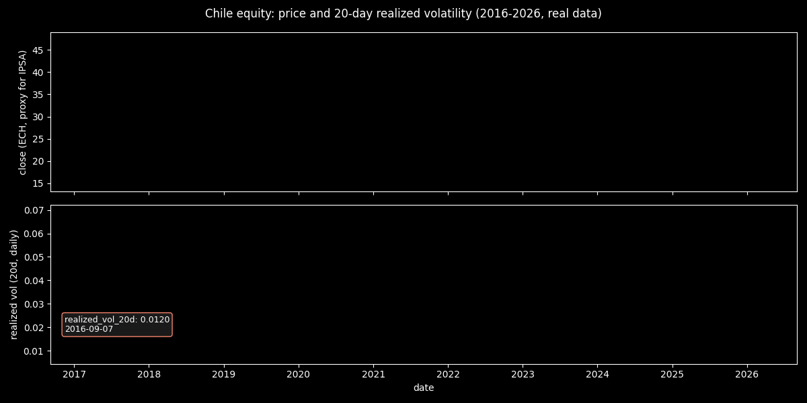
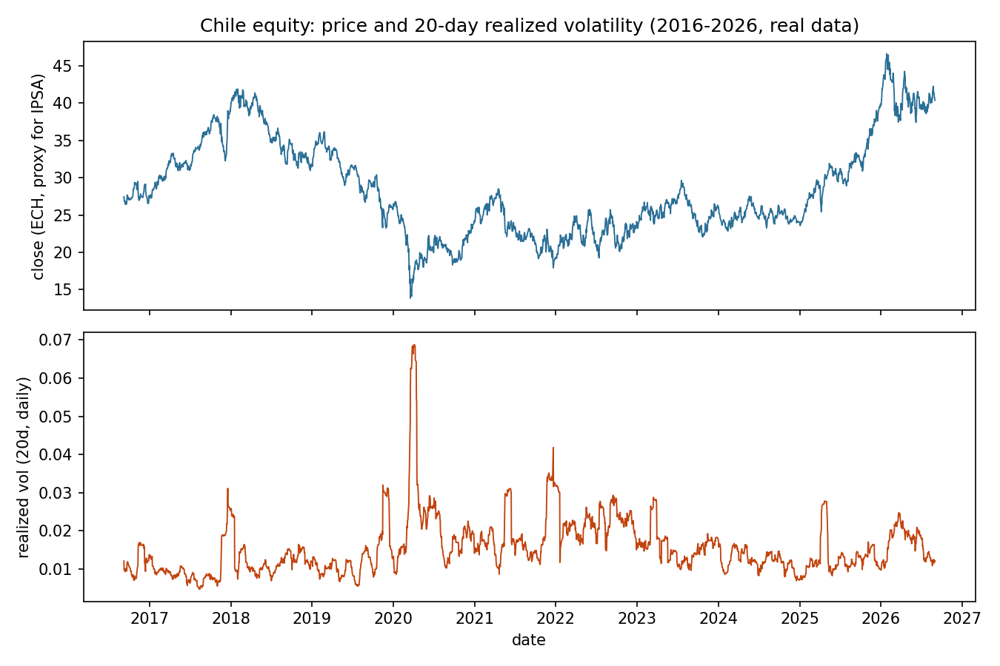
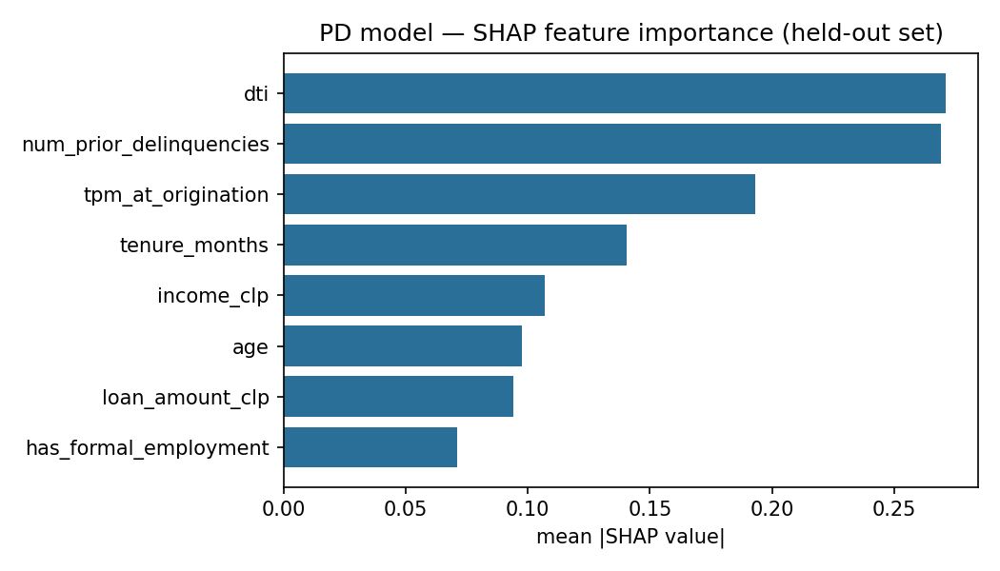
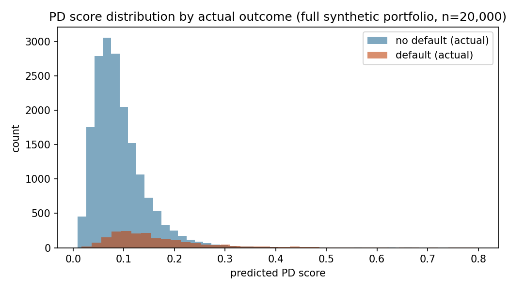
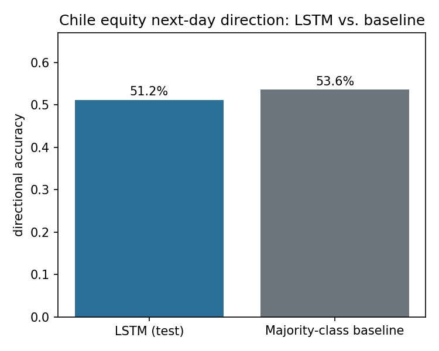
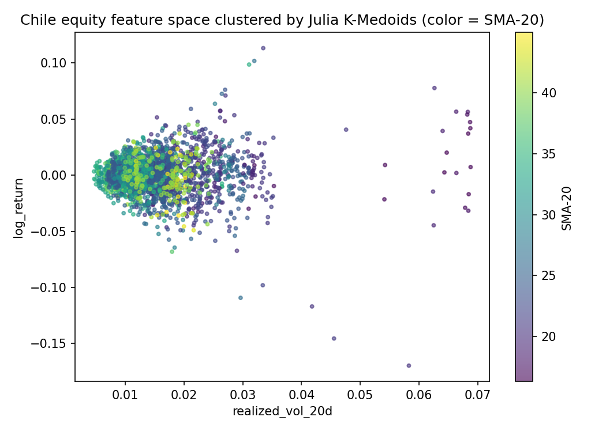
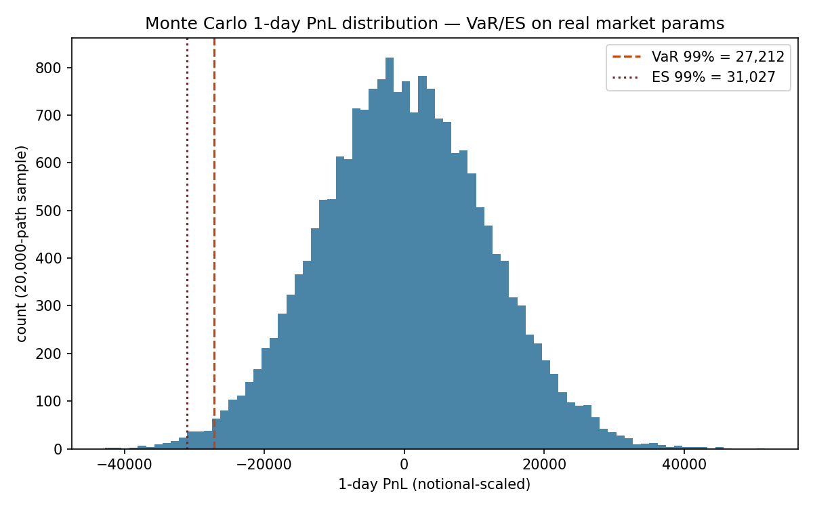

[ 🇺🇸 English ] | [ 🇨🇱 [Leer en Español](README.es.md) ]

# chile-fintech-systemic-risk

Polyglot architecture for systemic risk analysis of the Chilean financial market (IPSA, Central Bank rates, credit risk). Each language was chosen for the task it solves best, not for portfolio completeness.

**Project status: all 5 modules are functional and run on real data.** This README honestly documents real results, including honest-negative findings, rather than inflating them. Every figure in this document comes from a full re-run of all 5 modules on 2026-09-02; where a number shifted slightly from an earlier run (weight-init randomness, CPU timing) this run's value is what's shown.

## The problem

Systemic risk in a small, concentrated market like Chile's doesn't live in any single data source — it lives in how a shock in one layer propagates to the others. A Central Bank (BCCh) rate hike raises the financing cost for indebted households, which raises the probability of default (PD) on the credit book; at the same time, equity-market volatility (IPSA) tends to rise alongside rate uncertainty, and that volatility is exactly the input a pricing/VaR engine needs to quantify how much a position can lose on a bad day. No single model — not the credit model, not the market model — captures that full chain on its own.

This repo builds that chain end to end, with real data where it exists and documented assumptions where it doesn't: **ETL** consolidates public Chilean Central Bank series and a daily IPSA-proxy price into an analytical store; **ml_predictions** estimates credit PD (XGBoost, with SHAP as a hard requirement — a credit model that isn't explainable isn't deployable under any reasonable regulatory standard) and market direction (LSTM); **quant_analytics** supplies the classical econometric apparatus (cointegration, GARCH) a market-risk team would expect before trusting any ML model, plus clustering of volatility regimes and risk profiles; **core_engine** turns the real observed volatility into an actionable VaR/ES metric; and **api** exposes all of that the way it would actually be consumed in production — low-latency scoring, plus an explicit integration point into a legacy banking core. The thread running through all five isn't "one model per module" — it's a single risk chain that happens to cross five languages because each link in that chain has genuinely different requirements (regulatory explainability, econometric rigor, request throughput, numerical-compute latency).

One honest result of this exercise: measured against the public data actually available, the Chilean market behaves in a way that's hard to predict directionally (the LSTM doesn't beat a trivial baseline) but with highly persistent volatility (GARCH ≈ 0.987) — two sides of the same coin, and both relevant to how risk should actually be managed in practice: don't trust directional prediction, do trust active volatility-exposure management.

## Structure

| Module | Language(s) | Status |
|---|---|---|
| [`/etl`](etl) | Python + DuckDB (SQL) | ✅ Functional, real data |
| [`/ml_predictions`](ml_predictions) | Python (XGBoost, PyTorch, SHAP) | ✅ Functional (PD: documented synthetic; equity: real data) |
| [`/quant_analytics`](quant_analytics) | R + Julia | ✅ Functional, real data |
| [`/core_engine`](core_engine) | C++ (OpenMP) | ✅ Functional, real data |
| [`/api`](api) | Go + C# | ✅ Functional, real data |

## Techniques by module

| Module | Technique / algorithm | Library(ies) | Why |
|---|---|---|---|
| `/etl` | SQL view over a columnar store (log return, SMA-20, 20-day realized volatility) | Polars, DuckDB | Reproducible, auditable feature engineering in pure SQL, computed once instead of per-consumer |
| `/ml_predictions` (PD) | Gradient boosting (XGBoost) + Shapley-value explainability | `xgboost`, `shap`, scikit-learn | Trees for mixed tabular features; SHAP is a hard requirement for a credit model, not optional |
| `/ml_predictions` (equity) | Single-layer LSTM over 20-day sequences (log return, SMA-20, realized vol.) | PyTorch | Explicit temporal dependency, benchmarked against a majority-class baseline |
| `/quant_analytics` (R) | Engle-Granger cointegration (ADF on residuals), Granger causality, ARIMA(1,0,0)-GARCH(1,1) | `urca`, `vars`, `tseries`, `rugarch` | The standard econometric toolkit a market-risk team requires before trusting an ML model |
| `/quant_analytics` (Julia) | K-Medoids (Euclidean distance) on standardized features | `Clustering.jl`, `Distances.jl` | Pure matrix computation without Python's GIL overhead, suited to repeated clustering over large rolling windows |
| `/core_engine` | Parallel Monte Carlo simulation of Geometric Brownian Motion | C++20 + OpenMP | European option pricing and 99% VaR/ES need millions of paths; the hot path needs real parallelism, not something Python gives for free without FFI |
| `/api` (Go) | Stdlib HTTP service, offline-batch-scored / online-served | `net/http` (no dependencies) | Concurrent-request throughput serving already-computed predictions, not numerical compute |
| `/api` (C#) | Legacy banking-core integration stub, decisions based on real PD | .NET 8 | A documented integration contract (not a hidden mock) against a typical legacy Chilean banking system |

## `/etl` — what already runs

Two Python (Polars) ingestors against real public APIs:

- **`fetch_bcch_indicators.py`**: TPM, UF, dollar, CPI and IMACEC from [mindicador.cl](https://mindicador.cl) (the Chilean Central Bank's public source).
- **`fetch_chile_equity.py`**: daily OHLCV series for `ECH` (iShares MSCI Chile ETF) via Yahoo Finance. **Honest note:** `ECH` is used instead of the native `^IPSA` index because yfinance's `^IPSA` feed has a real data gap and stops returning rows after 2019-06-14 regardless of the requested range (verified 2026-08-31) — a source failure, documented rather than hidden.
- **`build_duckdb.py`**: consolidates both sources into `data/chile_fintech.duckdb`, with a `chile_equity_features` view (log return, SMA-20, 20-day realized volatility) computed in pure SQL over DuckDB.

```bash
python -m venv .venv && .venv/Scripts/pip install -r requirements.txt   # Windows
python etl/fetch_bcch_indicators.py
python etl/fetch_chile_equity.py
python etl/build_duckdb.py
```

Verified this session (2026-09-02): 155 Central Bank indicator rows, 2,511 `chile_equity_daily` rows spanning 2016-09-02 through 2026-09-01.




The animated version draws both series at the real data's pace (subsampled to ~45 frames from the 2,511 trading days) with a floating label tracking the current value on each line — a quick way to spot where volatility spikes, while the static chart below remains the reference for detailed reading.

Full `ECH` series 2016-2026: the top panel is the closing price, the bottom one the 20-day realized volatility computed in the DuckDB SQL view — volatility spikes line up with the choppier price stretches, and this is the base data everything downstream (LSTM, GARCH, clustering) builds on.

## `/ml_predictions` — what already runs

```bash
python ml_predictions/simulate_credit_portfolio.py   # documented synthetic portfolio
python ml_predictions/train_pd_model.py              # XGBoost + SHAP
python ml_predictions/train_lstm_equity.py           # directional LSTM on real data
python ml_predictions/make_charts.py
```

- **PD (XGBoost + SHAP):** held-out AUC = **0.6239** on a documented synthetic 20,000-applicant credit portfolio (default rate 10.01%; no public Chilean borrower-level dataset exists). SHAP confirms `dti` (0.271) and prior delinquencies (0.269) dominate the mean |SHAP value|, as designed into the simulation.




`dti` and `num_prior_delinquencies` account for most of the mean |SHAP value| — exactly the two variables that dominate the logistic function used to generate the synthetic defaults, so this chart doubles as a sanity check that the explainability pipeline recovers real signal, not noise. The PD-score distribution shows the (partial, consistent with a 0.62 AUC) separation between applicants who actually defaulted and those who didn't.

- **Directional LSTM (real data):** test accuracy = **51.0%**, below the majority-class baseline (**53.6%**). Honest finding, not discarded: with daily returns on a highly liquid asset and highly persistent volatility (see GARCH below), day-to-day direction behaves close to a random walk — the model finds no exploitable signal in the three features used (log return, SMA-20, 20-day realized vol.).



The LSTM bar sits below the baseline bar — not decorative, it's the visual evidence for the honest-negative finding: always predicting the more frequent class beats the trained model here.

## `/quant_analytics` — what already runs

```bash
Rscript quant_analytics/r/macro_econometrics.R
python quant_analytics/julia/export_for_julia.py && julia quant_analytics/julia/cluster_profiles.jl
python quant_analytics/make_charts.py
```

- **R:** UF-vs-dollar cointegration (Engle-Granger, ADF on residuals) gives a statistic of **-1.851** on just n=22 monthly observations — insufficient to conclude, documented honestly rather than forcing a reading. Granger causality of TPM on returns isn't evaluable in this window (only 1 unique TPM value across the ~30 aligned days). GARCH(1,1) on 2,510 daily returns is conclusive: volatility persistence (α+β) = **0.9871** — extremely persistent volatility, consistent with the LSTM not beating its baseline.
- **Julia:** K-Medoids (k=3) separates real volatility regimes in Chilean equity — the highest-volatility cluster (n=10, avg 20-day vol = 5.05%) has a **negative** average return (-8.29%), while the other two clusters (1.18% and 1.83% vol.) have positive average returns. K-Medoids (k=4) on credit-risk profiles: the lowest-DTI cluster (0.209) has a default rate of **6.1%**, the highest-DTI cluster among those evaluated (0.348) reaches **13.6%**.



## `/core_engine` — what already runs

```bash
python core_engine/cpp/export_params.py
cl /O2 /openmp /EHsc core_engine/cpp/montecarlo_var.cpp /Fe:core_engine/cpp/montecarlo_var.exe
core_engine/cpp/montecarlo_var.exe core_engine/cpp/data/market_params.csv core_engine/cpp/data/pnl_sample.csv
```

Monte Carlo (GBM) engine in C++20 + OpenMP, fed with real spot (40.39 CLP) and annualized volatility (18.97%) from Chilean equity: European call pricing (strike 41.20, price = 0.601 ± 0.0011 stderr) and 1-day 99% VaR/ES on a long position. Real result from this run: **1,000,000 paths in 14.6 ms** with 16 OpenMP threads; VaR 99% = 27,485, ES 99% = 31,406 (configured notional units).



Histogram of a 20,000-path subsample of 1-day PnL paths (the VaR/ES metrics themselves are still computed over the full million). The vertical lines mark where the 99% VaR and 99% Expected Shortfall fall on that distribution — the left tail is exactly what both metrics are measuring.

## `/api` — what already runs

```bash
python api/go/export_predictions.py && go run api/go/main.go
cd api/corporate_stubs/legacy_core_stub && dotnet run
```

Go service (stdlib, no dependencies) serving predictions already computed by the Python/XGBoost models — verified this session from the repo root: `/health` → `ok`; `/v1/equity/snapshot` responds with close=40.39, log return=-0.00272, 20-day realized vol=0.0120, plus the LSTM metrics; `/v1/credit/predictions` serves all 200 applicants with a real `pd_score` (e.g. applicant_id 0: PD=0.0724, DTI=0.23; applicant_id 1: PD=0.1338, DTI=0.275). The C#/.NET legacy-core-integration stub built and ran: two credit decisions (one approved, one rejected) based on the model's real PD scores.

## Interactive dashboard (Plotly, offline)

**[Open the interactive dashboard in your browser](https://htmlpreview.github.io/?https://github.com/Rxyxs/chile-fintech-systemic-risk/blob/main/outputs/interactive/systemic_risk_dashboard.html)**

A self-contained HTML file (`outputs/interactive/systemic_risk_dashboard.html`, generated by `scripts/make_interactive_dashboard.py` with `plotly`) built directly from `chile_fintech.duckdb` and the 200 real predictions served by the Go API — no invented data. The link above renders it live in the browser via `htmlpreview.github.io`, no cloning required. It includes:

1. `ECH` closing price + SMA-20 (left axis) and 20-day realized volatility (right axis), with an interactive range slider across the 2,509 days that have the feature computed.
2. A scatter of PD score (XGBoost) vs. DTI for the 200 applicants served by the API, colored by whether the applicant actually defaulted — the expected positive correlation between DTI/PD score and real default is visible, with enough noise to explain why the AUC is 0.62 and not higher.

## Why this language separation

- **Python + SQL (DuckDB)** for ETL: a mature data ecosystem, and DuckDB gives local columnar storage without operating a real warehouse — a good fit for financial time series of this size.
- **XGBoost/LightGBM + PyTorch** for modeling: gradient-boosted trees for tabular PD with mandatory SHAP (regulatory explainability), deep learning for time series where temporal dependence matters more than tabular features.
- **R** for classical econometrics (cointegration, Granger, ARIMA/GARCH): still the best-supported, most academically validated ecosystem for these specific tests.
- **Julia** for high-speed clustering: matrix computation without Python's GIL overhead, relevant for clustering over large rolling windows.
- **C++** for the Monte Carlo pricing/VaR engine: the system's hot path needs memory control and real parallelism (OpenMP), not something Python can give without FFI anyway.
- **Go** for the predictions API: throughput for many concurrent scoring requests, not heavy compute — the model already ran offline.

## Key results (2026-09-02 re-run)

| Module | Metric | Result |
|---|---|---|
| PD (XGBoost+SHAP) | Held-out AUC | 0.6239 |
| Equity direction (LSTM) | Accuracy vs. baseline | 51.0% vs. **53.6%** (doesn't beat baseline) |
| Econometrics (R, GARCH) | Volatility persistence | 0.9871 |
| Econometrics (R, cointegration) | ADF on residuals (UF vs. USD) | -1.851 (n=22, inconclusive) |
| Clustering (Julia) | Default rate, lowest-DTI cluster | 6.1% (vs. 13.6% for the riskiest evaluated) |
| Monte Carlo engine (C++) | 1M paths | 14.6 ms, 16 threads |
| Go API | Live-verified endpoints | `/health`, `/v1/equity/snapshot`, `/v1/credit/predictions` — 200 real predictions |
| C#/.NET stub | Verified credit decisions | 1 approved, 1 rejected, both based on real PD |
| Automated tests (pytest, CI) | 15 real tests | `etl/build_duckdb.py` (feature-view SQL) and all 3 `ml_predictions/` modules (synthetic generator, PD+SHAP, LSTM) |

## Next steps

All 5 modules are functional on real data. Documented follow-ups per module: a Temporal Fusion Transformer and a LightGBM challenger in `/ml_predictions`, a longer data window for the econometric tests in `/quant_analytics`, and evaluating Rust/Java as alternatives in `/core_engine` and `/api` respectively.

## Author

Pablo Reyes — Data Scientist, Santiago, Chile.

License: MIT — see [LICENSE](LICENSE).
