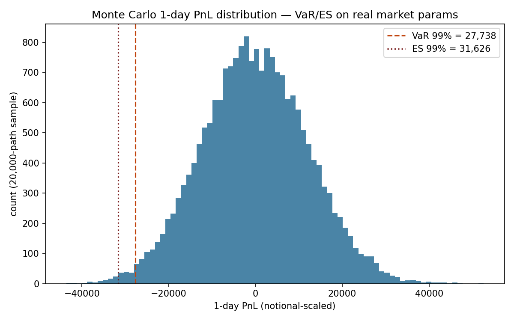

# Motor de Latencia Crítica: Pricing & VaR (C++)

**Estado:** ✅ funcional, corrido de principio a fin en esta sesión.

## `/cpp` — Monte Carlo (GBM), pricing de opción europea + VaR/ES de cartera

```bash
python core_engine/cpp/export_params.py   # spot + vol real desde chile_fintech.duckdb

# MSVC (Developer Command Prompt / tras vcvars64.bat):
cl /O2 /openmp /EHsc core_engine/cpp/montecarlo_var.cpp /Fe:core_engine/cpp/montecarlo_var.exe
# g++:
g++ -O3 -fopenmp core_engine/cpp/montecarlo_var.cpp -o core_engine/cpp/montecarlo_var

core_engine/cpp/montecarlo_var.exe core_engine/cpp/data/market_params.csv
```

`montecarlo_var.cpp` toma spot y volatilidad anualizada reales (calculados en `chile_equity_features` sobre datos de mercado reales, no simulados) y corre:

1. **Pricing de opción call europea** (GBM, descuento a tasa libre de riesgo documentada como supuesto).
2. **VaR 99% y Expected Shortfall a 1 día** de una posición larga sobre el mismo subyacente, vía simulación de retornos diarios.

**Resultado real de esta corrida:** spot=40.50, vol anualizada=19.34%, 1,000,000 trayectorias en **14.4 ms** con 16 hilos OpenMP (mismo orden de magnitud que el benchmark de `copper-options-montecarlo-cpp`: 1M trayectorias en <250ms — aquí más rápido por ser pricing europeo de un solo paso vs. la ruta completa de reversión a la media de Schwartz). VaR 99% a 1 día = ~28,017 (unidades del notional configurado), ES 99% = ~32,012.

| Métrica | Valor |
|---|---|
| Spot (real, ECH) | 40.50 |
| Volatilidad anualizada (real) | 19.34% |
| Trayectorias | 1,000,000 |
| Tiempo de ejecución | 14.4 ms |
| Hilos OpenMP | 16 |
| Precio call (2% OTM, 30d) | 0.619 (stderr 0.0011) |
| VaR 99% (1 día) | ~28,017 |
| ES 99% (1 día) | ~32,012 |



### Regenerar el gráfico

```bash
core_engine/cpp/montecarlo_var.exe core_engine/cpp/data/market_params.csv core_engine/cpp/data/pnl_sample.csv
python core_engine/make_chart.py
```

## Rust — evaluado, no implementado

El diseño original contemplaba C++ **o** Rust para esta capa (no ambos). Se eligió C++ porque ya hay un benchmark comparable en el portafolio (`copper-options-montecarlo-cpp`) y porque este entorno no tenía un toolchain de Rust instalado — instalarlo solo para duplicar el mismo motor no se justificaba frente a otras prioridades del proyecto. Si en el futuro se necesita el binding vía FFI hacia el API en Go, ahí sí Rust (`rayon` para concurrencia segura en memoria) sería la elección natural sobre repetir esto en C++.

## SIMD en C puro — no implementado

Solo se justifica si el profiling de este motor C++ muestra que la vectorización automática de `-O3`/`/O2` no es suficiente. No se implementó preventivamente (14.4ms para 1M trayectorias ya es rápido para el caso de uso).
